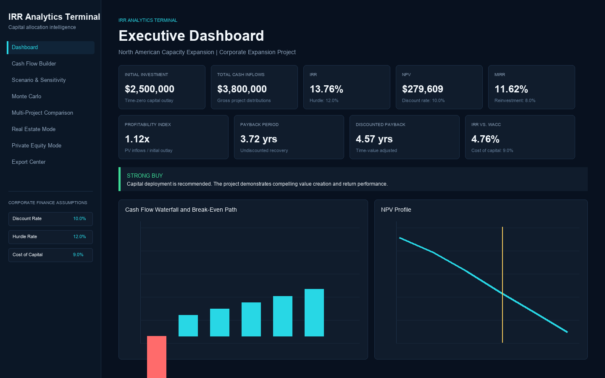
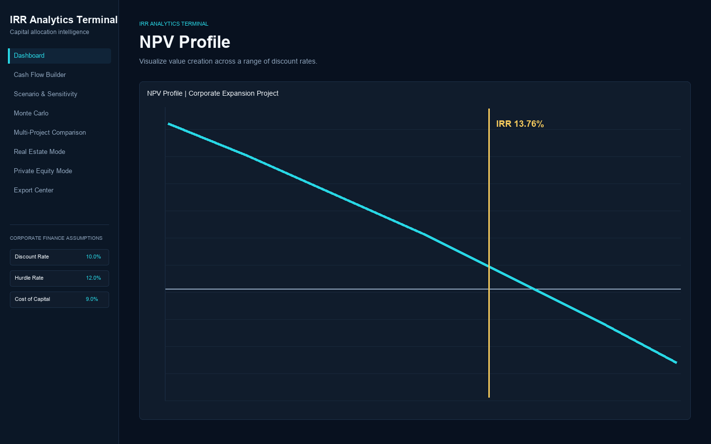
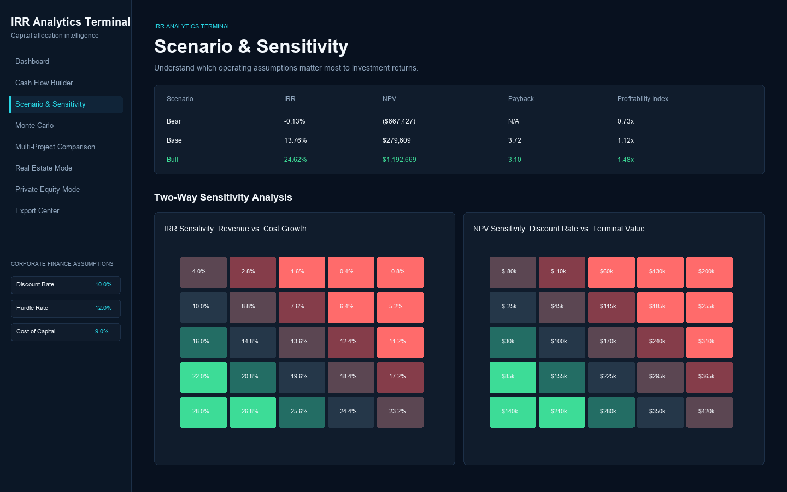
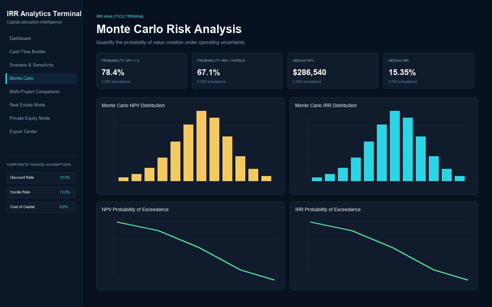
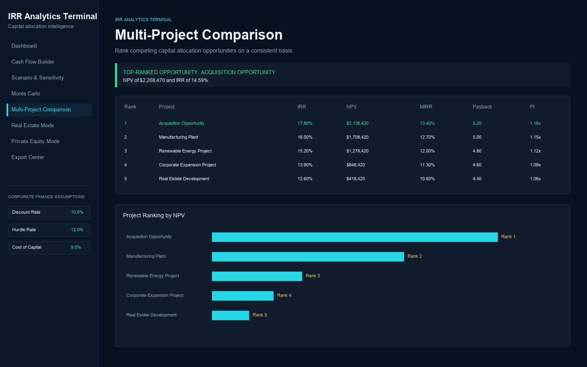

# IRR Analytics Terminal

**IRR Analytics Terminal** is a professional capital budgeting and investment decision platform built with Python and Streamlit. It combines a reusable corporate finance calculation engine with an institutional-style interface for evaluating projects, acquisitions, real estate investments, and sponsor returns.

This is not a single-metric IRR calculator. The platform is designed around the way finance professionals actually review capital deployment: value creation, return thresholds, payback, downside cases, sensitivity to assumptions, and the probability of achieving an acceptable outcome.

## Overview

IRR Analytics Terminal helps answer a practical investment committee question:

> Is this investment worth pursuing, and how confident should we be in that conclusion?

The application calculates and interprets:

- Internal Rate of Return (IRR)
- Date-aware XIRR and XNPV
- Net Present Value (NPV)
- Modified Internal Rate of Return (MIRR)
- Profitability Index (PI)
- Traditional and discounted payback periods
- Cash-flow break-even paths
- Bear, base, and bull scenarios
- Two-way IRR and NPV sensitivity tables
- Monte Carlo return distributions
- 5th percentile and downside-tail NPV risk metrics
- Multi-project capital allocation rankings

## Features

### Executive Dashboard

The dashboard presents decision-ready KPI cards, XIRR/XNPV for dated models, an automated investment recommendation, an auditable decision matrix, a cash-flow waterfall, cumulative break-even path, and an NPV profile with the project IRR marked where appropriate.



### Cash Flow Builder

Build custom cash-flow models with a dynamic time horizon, edit actual cash-flow dates, upload `.xlsx` or `.csv` files, validate inputs, or load one of five built-in example investments:

- Corporate Expansion Project
- Manufacturing Plant
- Acquisition Opportunity
- Real Estate Development
- Renewable Energy Project

### NPV Profile

The NPV profile plots project value across discount rates from 0% to 25%. It makes the relationship between discount rate, value creation, and IRR visually explicit.



### Scenario and Sensitivity Analysis

The terminal compares coherent bear, base, and bull cases and provides two-way heatmaps for:

- IRR sensitivity to revenue and cost changes
- NPV sensitivity to discount rates and terminal value assumptions



### Monte Carlo Risk Analysis

Run 1,000, 5,000, or 10,000 simulations using revenue, cost, and growth uncertainty assumptions. Outputs include:

- Distribution of IRRs
- Distribution of NPVs
- Probability of positive NPV
- Probability that IRR exceeds the hurdle rate
- Probability-of-exceedance curves
- 5th percentile NPV and IRR
- Downside tail average for the worst 5% of NPV outcomes
- Summary statistics and percentiles



### Multi-Project Comparison

Build a user-managed project pipeline and rank competing investments using a consistent set of capital budgeting assumptions. The terminal highlights the highest-value opportunity and compares IRR, NPV, MIRR, payback, and profitability index.



### Specialized Modes

**Real Estate Mode** evaluates purchase price, rental income, operating expenses, exit value, IRR, NPV, and equity multiple.

**Private Equity Mode** evaluates entry equity, entry debt, exit enterprise value, exit debt, debt paydown, sponsor IRR, and money-on-money returns.

### Professional Exports

The Export Center produces:

- A multi-tab Excel workbook with executive summary, dated and discounted cash flows, decision matrix, recommendation rationale, scenarios, and assumptions
- A PDF investment committee memo with recommendation, return benchmark chart, assumptions, scenario analysis, and risk analysis

## Example Analysis

The built-in **Corporate Expansion Project** requires an initial investment of `$2.5 million` and produces a five-year series of forecast cash inflows. At a 10% discount rate, the terminal evaluates whether the project creates value, clears the hurdle rate, achieves acceptable payback, and remains attractive under downside operating assumptions.

The automated recommendation engine does not rely on IRR alone. It considers NPV, IRR versus hurdle rate, IRR versus cost of capital, profitability index, discounted payback, and bear-case resilience to produce a transparent **Strong Buy**, **Consider**, or **Reject** conclusion.

## IRR Explained

Internal Rate of Return is the discount rate that sets project NPV equal to zero. IRR is useful because it expresses expected returns as an annualized percentage that can be compared with a hurdle rate or cost of capital.

IRR should not be viewed in isolation. Non-conventional cash flows can produce multiple IRRs, and IRR can mis-rank mutually exclusive projects with different scales or timing. The terminal therefore places IRR beside NPV, MIRR, and payback analysis.

## NPV Explained

Net Present Value is the present value of all project cash flows discounted at the required rate of return. A positive NPV indicates that the project is expected to create value after compensating investors for risk and the time value of money.

NPV is the platform's primary value-creation metric because it measures the absolute dollar value added by an investment.

## MIRR Explained

Modified Internal Rate of Return improves on IRR by using separate assumptions for:

- The financing rate applied to negative cash flows
- The reinvestment rate applied to positive cash flows

This removes the often unrealistic assumption that interim distributions can be reinvested at the project IRR.

## Monte Carlo Analysis

Deterministic forecasts hide the range of possible outcomes. The Monte Carlo module treats revenue, cost, and growth as uncertain variables and generates a distribution of project returns.

The result is a risk-aware view of the investment: not only the expected NPV or IRR, but also the probability that the project creates value or clears the required hurdle rate.

## Financial Theory

The platform follows several core capital budgeting principles:

1. **Value creation matters more than a headline return.** Positive NPV is the clearest indication that an investment creates economic value.
2. **Returns must be compared with required returns.** IRR is meaningful only relative to the hurdle rate and cost of capital.
3. **Liquidity and timing matter.** Payback analysis highlights how quickly capital is recovered.
4. **Point estimates are incomplete.** Scenario, sensitivity, and Monte Carlo analysis reveal the assumptions and risks behind the base case.
5. **Capital efficiency matters under constraints.** Profitability Index helps rank projects when available capital is limited.

See [docs/financial_theory.md](docs/financial_theory.md) for additional detail.

## Technology Stack

- Python
- Streamlit
- Pandas
- NumPy
- Plotly
- SciPy
- OpenPyXL
- fpdf2
- Pytest

## Installation

```bash
git clone https://github.com/Raphael-Azerad/irr-analytics-terminal.git
cd irr-analytics-terminal
python -m venv .venv
source .venv/bin/activate
pip install -r requirements.txt
```

## Usage

Launch the application:

```bash
streamlit run app.py
```

Then open the local Streamlit URL shown in the terminal. Use the sidebar to move between the executive dashboard, modeling tools, risk analysis, specialized modes, and export center.

Sample upload files are available in the [`examples/`](examples/) directory.

## Repository Structure

```text
.
├── app.py
├── calculations/
│   ├── metrics.py
│   ├── monte_carlo.py
│   ├── recommendation.py
│   ├── scenarios.py
│   └── specialized.py
├── data/
│   └── examples.py
├── reports/
│   └── exporters.py
├── visualizations/
│   └── charts.py
├── utils/
│   └── io.py
├── tests/
├── docs/
├── examples/
├── screenshots/
└── .github/workflows/ci.yml
```

## Testing and CI

Run the test suite locally:

```bash
pytest -q
```

GitHub Actions installs dependencies, runs the tests, and validates that the application modules compile successfully on every pull request and push to the primary branch.

## Future Improvements

- Debt schedules, interest coverage, and leverage covenant analysis
- Portfolio-level capital allocation optimization
- Correlated simulation variables and custom probability distributions
- Authentication and persistent project storage
- Branded report templates and embedded chart exports

## License

This project is released under the MIT License.
